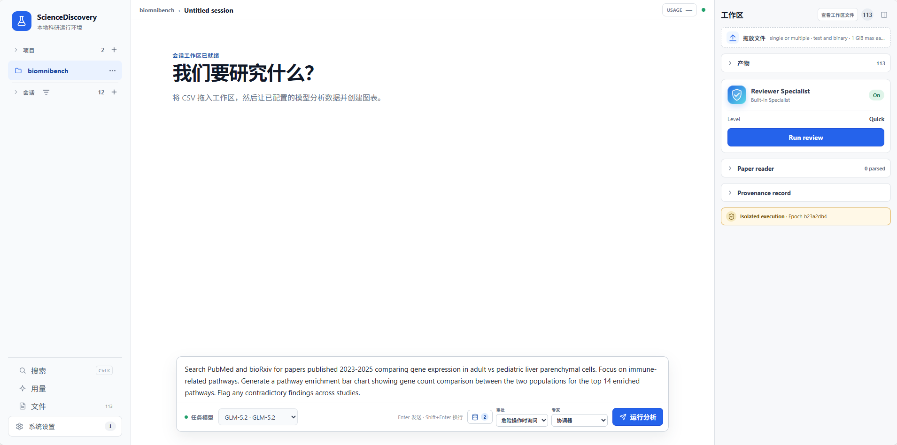

<div align="center">

# ScienceDiscovery

**专为科研打造的一站式 AI 科研工作台。**

文献阅读、假设提出、代码编写、实验试错、参数调优 —— 在同一个环境里完成，每一步都留痕。

[](LICENSE)
[](https://github.com/openJiuwen-ai/sciencediscovery/releases/tag/0.2.0)
[](#环境要求)

[下载](#安装) · [快速开始](docs/zh/tutorial/01-quick-start.md) · [文档](docs/README.md) · [贡献指南](CONTRIBUTING.md) · [English](README.md)



</div>

## 这是什么

一个本地科研工作台：智能体阅读文献、在沙箱里编写并运行代码，并记录每个结果的来源。它跑在你自己的机器上，处理你自己的文件，使用你自己的模型密钥。

## 安装

从 [release 0.2.0](https://github.com/openJiuwen-ai/sciencediscovery/releases/tag/0.2.0) 下载与宿主架构匹配的构建：

```bash
curl -LO https://github.com/openJiuwen-ai/sciencediscovery/releases/download/0.2.0/ScienceDiscovery-0.2.0-linux-x86_64
chmod +x ScienceDiscovery-0.2.0-linux-x86_64
./ScienceDiscovery-0.2.0-linux-x86_64 serve
```

随后打开 `serve` 打印的 **`Open to sign in`** 链接。浏览器会自动保存本地服务访问令牌，不用手动复制。该令牌不是模型 API Key，而这个链接能访问本机工作区，请勿外传。界面本身在 <http://127.0.0.1:4310>，终端窗口只是服务进程。

arm64 请用 [`ScienceDiscovery-0.2.0-linux-aarch64`](https://github.com/openJiuwen-ai/sciencediscovery/releases/download/0.2.0/ScienceDiscovery-0.2.0-linux-aarch64)。宿主唯一依赖是 Bubblewrap。本地源码模式（Linux 与 macOS）和 Docker 见[部署指南](docs/zh/how-to/deployment.md)。

## 配置模型

产品不自带模型，用你自己的 API。点左侧栏底部的**系统配置**：

1. **模型注册表** —— 添加服务商（选预置，或手填基础 URL），填入 API Key，再添加要用的模型。
2. **全局默认值** —— 把该模型设为任务模型。

字段说明与可用环境变量见[配置参考](docs/zh/reference/configuration.md)。

## 第一个任务

新建项目与会话，把 CSV 或 PDF 拖进工作区，描述你要的分析目标。首次代码执行会弹出权限卡片，批准后即可在时间线里看到工具调用与产物。完整步骤见[快速开始](docs/zh/tutorial/01-quick-start.md)。

## 能用它做什么

| 能力 | 含义 | 了解更多 |
|---|---|---|
| **文献与数据触手可及** | 内置连接器直达文献库与数据库；PDF 被解析为可引用的证据 | [文献调研案例](docs/zh/how-to/literature-research-case-guide.md) · [自定义 MCP](docs/zh/how-to/configure-custom-mcp.md) |
| **代码真的会跑起来** | 智能体在 fail-closed 沙箱中编写、调试并运行 Python、R 与 Shell | [沙箱执行](docs/zh/explanation/sandbox-execution.md) |
| **复杂任务自动拆解** | 任务规划与多智能体协同把任务拆给子智能体和跨领域 Skill 库 | [子智能体编排](docs/zh/explanation/subagent-orchestration.md) · [Skill](docs/zh/explanation/skill-progressive-disclosure.md) |
| **每个结果都可溯源** | 代码、环境、日志与引用证据按产物记录；开启记忆图谱后整条链路可点击追溯 | [审阅与溯源](docs/zh/explanation/review-provenance.md) · [ScienceMemory](docs/zh/how-to/science-memory-setup.md) |

## 命令行

已启动的 `serve` 也可以从终端驱动：

```bash
./ScienceDiscovery run "总结这些结果" > answer.md
cat prompt.txt | ./ScienceDiscovery run --stdin --auto-approve | jq .
```

`run` 连接与浏览器相同的控制面，并从数据目录读取访问 token，因此只要与 `serve` 共用 `--data-dir` 就无需额外配置。在终端里答案走 stdout、进度走 stderr；在管道中输出 JSONL，且非交互运行必须显式传 `--auto-approve`，因为它无法回答权限询问。完整选项见 `./ScienceDiscovery run --help`。

## 环境要求

| 路径 | 宿主要求 |
|---|---|
| **预打包二进制** | Linux x86_64/aarch64、Bubblewrap |
| **本地源码模式** | Linux x86_64/aarch64 或 macOS x64/arm64；Node.js 22.19+、pnpm 11.1.2、Python 3、uv 0.9+、Git；Linux 用 Bubblewrap，macOS 用系统内置 Seatbelt |
| **Docker** | Linux x86_64/aarch64、Docker Engine 24+、Compose v2、可用的无特权用户命名空间 |

托管科学环境运行在固定版本的 micromamba 上，不要求系统安装 Python、R 或 conda。

## 工作原理

浏览器 UI 与 Node 控制 API 通信。每次智能体运行由 Python Gateway 驱动，而工作区工具、沙箱执行、科研连接器、PDF 抽取、权限、溯源与审阅校验由 Node 控制面统一管控。

> [!WARNING]
> ScienceDiscovery 不是多用户生产服务。API、runner 与 gateway 默认只监听回环；API 使用一个 bearer token 且不终止 TLS。监听其他网卡必须是可信、受保护网络中的显式部署选择。Python、R 和 shell 命令在 fail-closed 的平台沙箱中运行（Linux 使用 Bubblewrap，macOS 源码模式使用 Seatbelt）；控制 API、gateway、PDF worker 以及发往已配置模型/数据提供方的请求在沙箱外作为受信任控制面操作执行。

## 文档

| 分类 | 文档 |
|---|---|
| **教程** | [快速开始](docs/zh/tutorial/01-quick-start.md) |
| **How-to** | [部署](docs/zh/how-to/deployment.md) · [自定义 MCP](docs/zh/how-to/configure-custom-mcp.md) · [网络代理](docs/zh/how-to/configure-network-proxy.md) · [ScienceMemory](docs/zh/how-to/science-memory-setup.md) |
| **参考** | [配置](docs/zh/reference/configuration.md) · [REST API](docs/zh/reference/rest-api.md) · [内置工具](docs/zh/reference/builtin-tools.md) · [运行时行为](docs/zh/reference/runtime-behavior.md) |
| **解释** | [整体架构](docs/zh/explanation/architecture.md) 及[完整索引](docs/zh/explanation/README.md) |

完整中英文导航见 [docs/README.md](docs/README.md)。开发环境与测试命令见 [CONTRIBUTING.md](CONTRIBUTING.md)。

## 许可证

[Apache License 2.0](LICENSE)。

本产品仅作为流程编排工具，不包含 AI 模型能力；用户在连接 AI 模型用于特定业务场景时，需自行承担欧盟 AI 法案等相关合规义务。
